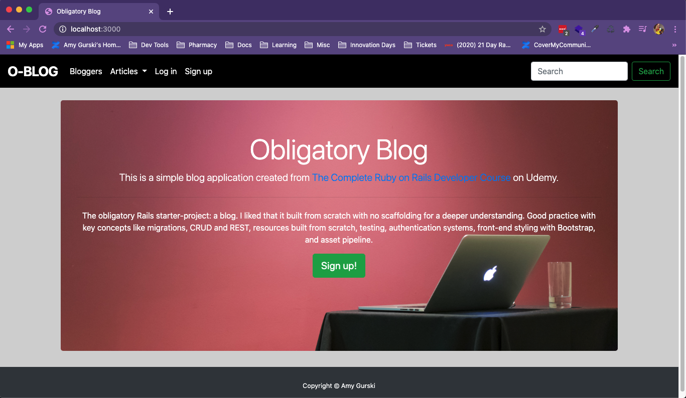

# README

This blog is a tutorial from [The Complete Ruby on Rails Developer Course](https://www.udemy.com/course/the-complete-ruby-on-rails-developer-course/learn/lecture/19484676#questions)

I feel like this is the 'obligatory' starter-project for working with Rails in many tutorials. That said, I liked that it is built from scratch with no scaffolding for more practice and a deeper understanding since I'm mostly doing rails development for work right now. 

Good practice with key concepts like the MVC design pattern, migrations, CRUD and REST, testing, authentication systems, front-end styling with Bootstrap, and asset pipeline. 

# Resources
## User
Includes validations 
- username must be present and unique, min 3 max 25
- email address must be present and unique, max 105 
- email must be valid email format, check with email regex

## Article
Includes validations on title & description length

# Associations

One-to-many between users and articles

# Authentication

Login using secure password using bcrypt gem

# Restriction of actions

Based on logged in/logged out state

# Security

Admin user functionality and access level
